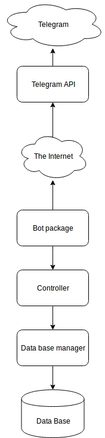

# Library Help Bot
-----
### Purpose of the application
This is the implementation of Library Management System (LMS). LMSs
are used in libraries to track the different items in the library. The system
contains all information about books, magazines, audio/video materials, as
well as people allowed to check out the materials or those in charge of the
management. LMS is implemented as a Telegram bot.
### How it works

1. Bot package sends request to Telegram via API and as a response it gets messages from users exploiting the bot.
2. Bot analyzes the response and sends commands to the controller which executes the command and makes according changes in the database.
### Dependencies
* python
* python-telegram-bot
* pytest
* sqlite3
### Installation
##### Requirements
1. python3
2. pip3
3. git
##### Preparing
1. Install all libraries stated in the requirements.txt by typing the command below in command line.
```bash
    pip3 install -r requirements.txt
```
2. Install MariaDB from official [site](https://mariadb.org/)
2. Downlaod the repository from [Github](https://github.com/LibrinnoTeam/LibraryHelpBot)
 * First way is to download zip archive and then unzip it to the work directory.
 * Second way is to clone repository to the work directory via
```bash
    git clone https://github.com/LibrinnoTeam/LibraryHelpBot.git
```
3. Change password in database-schema.sql
4. Execute database-schema.sql in MariaDB
```sql
    source path/to/work/directory/AdminSite/database-schema.sql
```
5. Create file configs.py in work directory
``` python
    token                  = '*' # Token for telegram bot https://core.telegram.org/bots
    site_login_databse     = 'admin_site' # login for MariaDB
    site_password_database = '*' # password for MariaDB
    site_database          = 'librarian_site' # Name of Database in MariaDB
```
##### Running
1. To run the application with default parameters just typing the command below in command line.
 ```bash
    python3 main.py
 ```
 2. General view of the command that starts a bot
```bash
    python3 main.py -t -c --log_file=<filelog> --database=<filedb> --cleanup_database
```
* Argument -t means that the command runs the tests
* Argument -c means that the application will write logs into console
* Argument --log_file=<filelog> means that the application will write logs into file with name in parameter <filelog>
* Argument --database=<filedb> means that the application will use bd in file with name in parameter <filedb>
* Argument --cleanup_database means that the application will drop tables in database